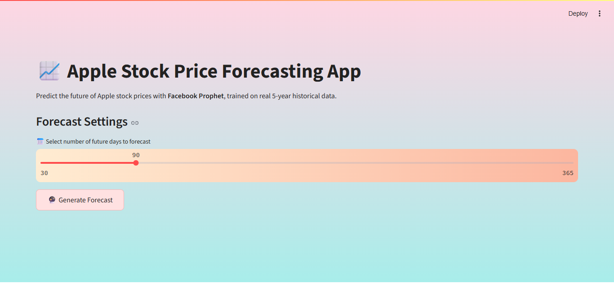
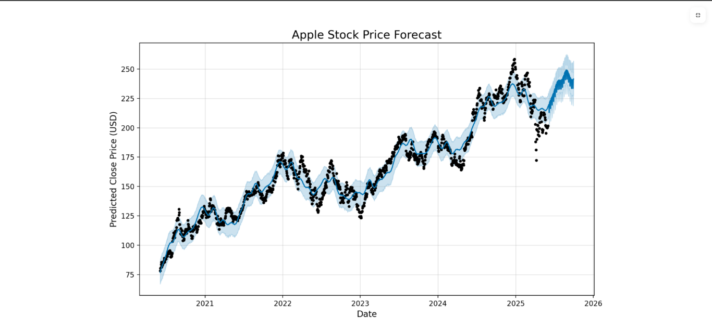
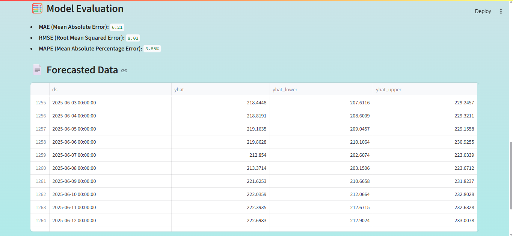

# 📈 Apple Stock Price Forecasting App

A visually polished and interactive **Streamlit web app** that forecasts **Apple Inc. (AAPL)** stock prices using Facebook's **Prophet** time series model.

---

## 🔮 What This App Does

- 📊 Trains a powerful time series forecasting model using 5 years of AAPL stock data  
- 🔧 Dynamically generates future predictions based on user-selected forecast horizon  
- 💡 Evaluates prediction performance using **MAE**, **RMSE**, and **MAPE**  
- 🖼️ Plots clean visual forecasts with confidence intervals  
- 📥 Allows users to download forecasted data as CSV  
- 🌈 Comes with a **modern UI**, gradient background, and customized light theme  

---

## 🚀 Live Demo

Check out the deployed app 👉  
🌐 [Apple Stock Forecasting App – Streamlit](https://stock-forecasting-app-vcfos2fekk2flfywnkzcfn-parthmendiratta.streamlit.app/)

---

## 📸 App Screenshots

> *Forecasting Apple Stock Prices with Confidence Intervals*

### 🟣 1. App UI – Forecast Input Section


### 🔵 2. Forecast Plot – Prophet Prediction


### 🟢 3. Evaluation Metrics & Forecasted Data


---

## 📂 Folder Structure

```
📁 stock-forecasting-app/
├── app.py                  # Main Streamlit application
├── apple_5yr_one.csv       # 5-year Apple stock price dataset
├── requirements.txt        # Python dependencies
├── README.md               # Project showcase and guide
└── .streamlit/
    └── config.toml         # Light theme config for Streamlit
```

---

## ⚙️ Technologies Used

- **Python 3.11+**
- **Prophet** for time series forecasting
- **Streamlit** for frontend interface
- **scikit-learn** for evaluation metrics
- **pandas**, **numpy**, **matplotlib** for data handling and visualization

---

## 📦 Setup & Run Locally

```bash
# 1. Clone the repository
git clone https://github.com/parthmendiratta/stock-forecasting-app.git

# 2. Navigate into the folder
cd stock-forecasting-app

# 3. Install dependencies
pip install -r requirements.txt

# 4. Run the Streamlit app
streamlit run app.py
```

---


## 👨‍💻 Author

Developed with ❤️ by **[Parth Mendiratta](https://www.linkedin.com/in/parthmendiratta)**
